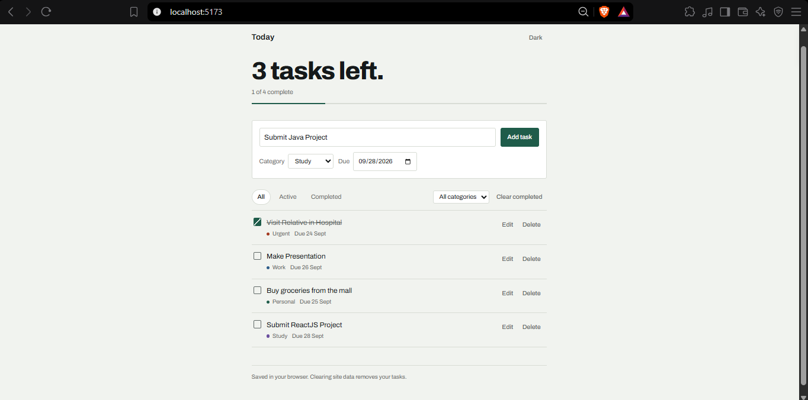
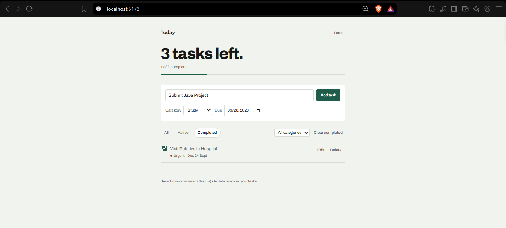
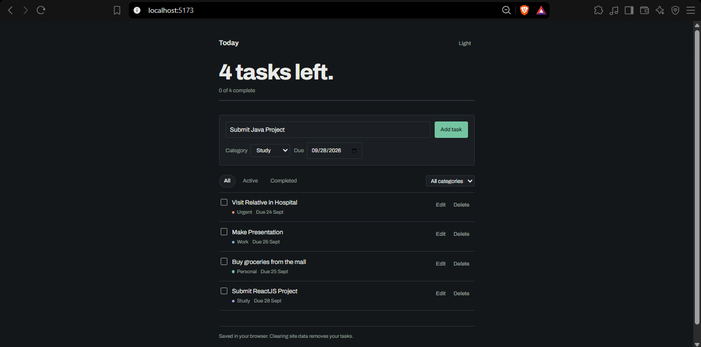

# Task Manager

A single-page task manager built with React. Tasks can be added, edited, categorised, given a due date and marked complete, and everything is filtered by status or category from one screen. All data is saved in the browser's localStorage, so the list survives a page refresh.

## Features

- Add, edit, delete and complete tasks
- Filter by status: All / Active / Completed
- Organise tasks by category (Work, Study, Personal, Urgent), with a category filter
- Live count of remaining and completed tasks, plus a progress bar
- Tasks and theme choice persisted in localStorage
- Due dates, with overdue tasks highlighted
- Dark / light theme toggle
- Clear all completed tasks in one action
- Separate empty states for "no tasks yet" and "no tasks match these filters"
- Inline validation when submitting an empty task
- Responsive layout for desktop and mobile widths

## Technologies used

- React 18 (functional components and hooks only)
- Vite (dev server and build tool)
- Plain CSS with custom properties for theming
- Archivo via Google Fonts
- Browser localStorage API

## Project structure

```
src/
├── components/
│   ├── EmptyState.jsx    Message shown when the list has nothing to display
│   ├── FilterBar.jsx     Status chips, category select, clear-completed
│   ├── Header.jsx        Title and theme toggle
│   ├── TaskForm.jsx      Controlled form for creating a task
│   ├── TaskItem.jsx      One task row, including its inline edit mode
│   ├── TaskList.jsx      Maps the visible tasks to TaskItem
│   └── TaskStats.jsx     Remaining/completed counts and progress bar
├── hooks/
│   └── useLocalStorage.js  useState + useEffect wrapper that persists state
├── App.jsx               Holds task state and all the handlers
├── constants.js          Categories, filters and small date helpers
├── index.css             Theme variables and all styling
└── main.jsx              Entry point
```

State lives in `App.jsx` and flows down through props; child components report changes back through callback props (`onAddTask`, `onToggle`, `onEdit`, `onDelete`). The one exception is `TaskItem`, which keeps its own editing state because no other component needs it.

## Setup

```bash
npm install
npm run dev
```

The dev server prints a local URL (usually http://localhost:5173).

To build and preview the production version:

```bash
npm run build
npm run preview
```

## Screenshots

Replace these placeholders with your own screenshots of the running app. Create a `screenshots/` folder in the project root, drop the images in, and keep the file names below.







## Known limitations

- Data is stored per browser. Clearing site data removes all tasks, and the list does not sync between devices.
- Single view, so React Router is not used (the assignment makes it optional for one-page apps).
- Drag-and-drop reordering was not implemented; tasks appear newest first.
- Categories are fixed in `src/constants.js` and cannot be edited from the interface.
- Overdue status is based on the device's local date.
